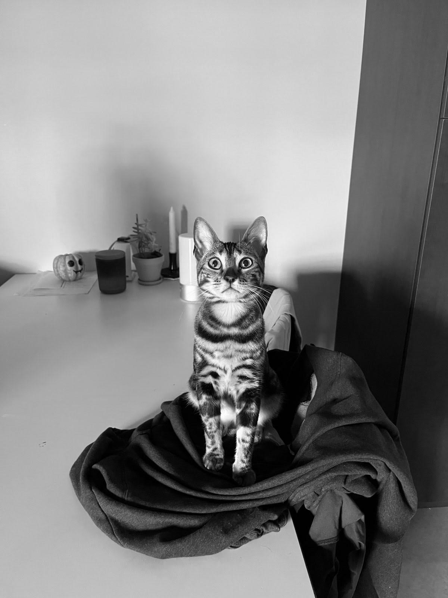

# Grayscale Converter

This project is a simple tool for converting color images to grayscale using OpenCV.

## Dependencies

- OpenCV (version 4.x)

## Build Instructions

1. Clone the repository to your local machine.
2. Create a new directory called `build` in the project root directory.
3. Navigate to the `build` directory in your terminal.
4. Run `cmake ..` to configure the project.
5. Run `make` to build the executable.

## Usage

The executable takes two command line arguments: the input image file path and the output image file path.

```bash
./GrayScaleConverter <in-path> <out-path>
```

## Example
```bash
./GrayScaleConverter input.jpg output_gray.jpg
```

<table>
  <tr>
    <td></td>
    <td></td>
  </tr>
</table>

## License

MIT